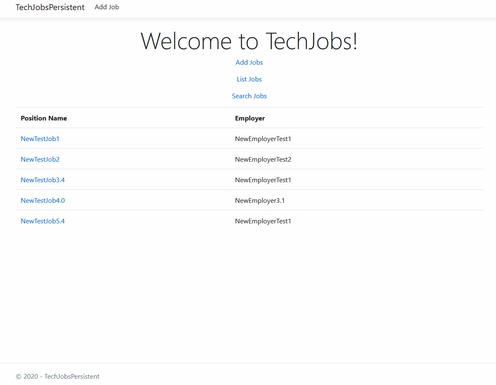

<h1>Tech Jobs Search</h1>

## Purpose
Class Project: The Launch Checklist Form makes it easy for astronaut's to validate the information necessary to ensure a safe and successful launch of the group's vessel.

## Skills
<ul>
<li>C#</li>
<li>ASP.NET</li>
<li>Razor Markup</li>
<li>MVC</li>
<li>EF Framework Core</li>
<li>MySQL</li>
<li>HTML, Forms & CSS</li>
</ul>

## Features

<ul>
<li>List available jobs;</li>
<li>Add new employers, new skills and new jobs;</li>
<li>Relate employer and skills to individual jobs;</li>
<li>Select job to view details;/li>
<li>Case insensitive search of jobs by skill or employer name.</li>
</ul>
